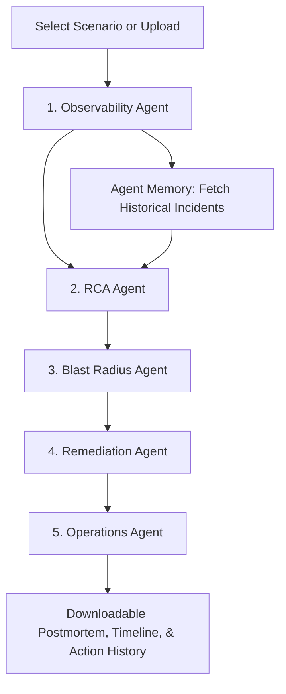

# Implementation Plan: OpsPilot AI (Autonomous Incident Diagnosis, RCA, and Resolution)

## Goal Description
We will build **OpsPilot AI**, an **Autonomous Operations Intelligence Platform** (mapped to AGENTS_026, AGENTS_032, and AGENTS_007). 
Instead of pitching it as "AI for incident management," our core pitch is:
> "An Autonomous Operations Intelligence Platform that reasons across logs, metrics, and alerts, predicts business impact, recommends remediation, and generates post-incident knowledge automatically."

To make this platform highly robust, enterprise-grade, and fail-proof for the hackathon judges, we will introduce:
1. **Agent Memory Panel (Historical Incident Matching)**: A section in the dashboard showing "Known Similar Incidents" (e.g. INC-1024: Database Pool Exhaustion, occurred 3 weeks ago, resolved by increasing pool size). This simulates vector-database semantic search over historical incidents.
2. **Fail-Proof Dropdown Scenarios**: The dashboard will allow judges to select preloaded scenarios (Scenario 1: Database Pool Exhaustion, Scenario 2: Memory Leak, Scenario 3: Network Latency) with a single click, completely eliminating file upload errors during the demo while keeping manual upload as an optional feature.

---

## User Review Required
> [!IMPORTANT]
> This is the finalized, optimized plan. By utilizing preloaded mock data and simulating advanced enterprise features (like Vector DB historical matching), we keep code complexity low while maximizing the wow-factor for the judges.
> 
> Please review and approve this final plan so we can begin coding.

---

## Proposed Architecture & Workflow

### Key Dashboard Components
- **Scenario Selector**: High-visibility selector for Scenario 1 (DB Connection Pool Exhaustion), Scenario 2 (OOM Memory Leak), and Scenario 3 (Telecom Network Latency).
- **Agent Memory Panel**: Displays matching historical tickets found in our simulated postmortem vector store.
- **Collaborative Dialogue Box**: Displays individual agent confidence scores and their consensus negotiation.
- **Blast Radius & Predictive Impact Panel**: Lists affected downstream services, business severity, and a warning card for the "Do Nothing" Predictive Impact.
- **Remediation Action Board & Incident Timeline**: "Approve Recovery" button that updates the interactive timeline.
- **Postmortem Report Viewer**: Generates clean markdown with an instant download button.

---

## Proposed Changes

### Backend

#### [NEW] [agents.py](file:///c:/Users/shrey/Documents/Repos/tcs-amd-hackathon/backend/agents.py)
- Sequential LLM orchestration for the 5 agents.
- Integrates historical incidents (simulated agent memory retrieval) into the RCA Agent's context.
- Returns structured JSON containing: agent reasoning, consensus output, individual confidence scores, timeline steps, blast radius metrics, and the final postmortem report.

#### [NEW] [tools.py](file:///c:/Users/shrey/Documents/Repos/tcs-amd-hackathon/backend/tools.py)
- Pre-packaged historical incidents database (mock vector store).
- Mock execution commands (e.g., `scale_k8s_replicas()`, `update_incident_log()`).

### Frontend & Preloaded Data

#### [NEW] [app.py](file:///c:/Users/shrey/Documents/Repos/tcs-amd-hackathon/app.py)
- Dark-mode NOC Dashboard using Streamlit.
- Preloaded scenarios accessible via simple sidebar buttons.
- Interactive timeline and "Approve Remediation" flows.
- PDF/Markdown download of the generated postmortem report.

#### [NEW] [data/](file:///c:/Users/shrey/Documents/Repos/tcs-amd-hackathon/data/)
- Prepackaged incident text files and metrics JSON for the dropdown scenarios.

---

## Verification Plan

### Manual Verification
- Test all three preloaded scenarios in the UI and verify that the "Agent Memory Panel" correctly matches similar incidents.
- Verify that the "Do Nothing" predictive impact changes dynamically based on the scenario selected.
- Test the Postmortem download button to ensure the report format matches enterprise standards.
- Capture latency and token usage metrics to fill out the presentation slides.
